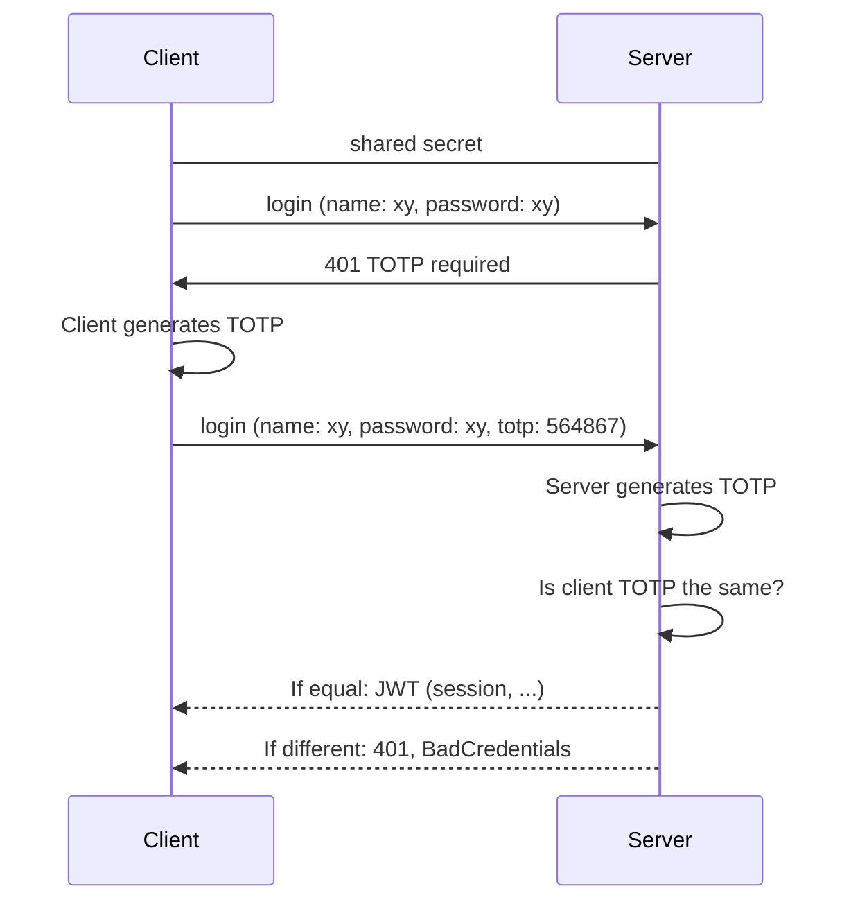
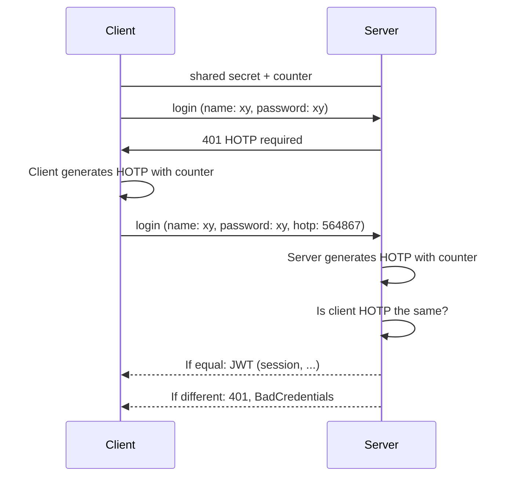

# totp-kt - Kotlin OTP Library
[](https://sonarcloud.io/summary/new_code?id=robinohs_totp-kt)

[](https://opensource.org/licenses/MIT) [](https://dl.circleci.com/status-badge/redirect/gh/robinohs/totp-kt/tree/main) [](https://codecov.io/gh/robinohs/totp-kt) [](https://sonarcloud.io/summary/new_code?id=robinohs_totp-kt) [](https://sonarcloud.io/summary/new_code?id=robinohs_totp-kt) [](https://sonarcloud.io/summary/new_code?id=robinohs_totp-kt) [](https://sonarcloud.io/summary/new_code?id=robinohs_totp-kt)

Native Kotlin library for time-based TOTP and HMAC-based HOTP one-time passwords.
Enables the developer to:
- validate and generate TOTP [(RFC 6238)](https://datatracker.ietf.org/doc/html/rfc6238) and HOTP [(RFC 4226)](https://datatracker.ietf.org/doc/html/rfc4226) one-time passwords,
- generate randomly secure secrets to use with authenticators,
- generate randomly secure recovery codes.

# Navigation
 - [Installation](#installation)
	- [Jitpack](#jitpack)
		- [Kotlin DSL](#kotlin-dsl)
		- [Maven](#maven)
		- [Gradle](#gradle)
 - [Usage](#usage)
    - [TOTP (Time-based One-Time Password)](#totp-time-based-one-time-password)
    - [HOTP (HMAC-based One-Time Password)](#hotp-hmac-based-one-time-password)
    - [Recovery code generator](#hotp-hmac-based-one-time-password)
    - [Google Authenticator](#google-authenticator)
  - [License](#license)


# Installation

> Only Jitpack is supported in the alpha phase.

## Jitpack
If you are using Jitpack as a repository, you can follow one of the following sections to install using with your favorite package manager such as gradle or maven.

#### Kotlin DSL
Add Jitpack to repositories:
```kotlin
//build.gradle.kts
repositories {  
  mavenCentral()  
  maven { url = uri("https://jitpack.io") }  
}
```
Add the dependency:
```kotlin
//build.gradle.kts
dependencies {
  implementation("com.github.robinohs:totp-kt:v1.0.2-alpha")
}
```
#### Maven
Add Jitpack to repositories:
```xml
//pom.xml
<repositories>
  <repository>
    <id>jitpack.io</id>
    <url>https://jitpack.io</url>
  </repository>
</repositories>
```
Add the dependency:
```xml
//pom.xml
<dependency>
  <groupId>com.github.robinohs</groupId>
    <artifactId>totp-kt</artifactId>
    <version>v1.0.2-alpha</version>
</dependency>
```
#### Gradle
Add Jitpack to repositories:
```kotlin
//build.gradle
allprojects {
  repositories {
    ...
    maven { url 'https://jitpack.io' }
  }
}
```
Add the dependency:
```kotlin
//build.gradle
dependencies {
  implementation 'com.github.robinohs:totp-kt:v1.0.2-alpha'
}
```
# Usage
## TOTP (Time-based One-Time Password)
The time-based one-time password method, generates one-time passwords by using a shared secret in combination with a time window as the source of uniqueness. The TOTP algorithm is an extension of [HOTP](#hotp-hmac-based-one-time-password). The algorithm is used by commonly known authenticator apps, e.g. Google Authenticator, Mircrosoft Authenticator and others.

### TOTP flow

### Create a TOTP generator
You can create an instance of the TotpGenerator in the following way:
```kotlin
val totpGenerator = TotpGenerator()
```
### Use the TOTP generator
#### Generate Code
After you created the totpGenerator instance you can generate a one-time password by calling the generatore code method with the secret as an argument. Optionally, if you want to specify a specific time and not have the generator to take the current time itself, you can pass a time as an argument.
```kotlin
val secret = some base32_encoded_secret_as_bytearray
val code = totpGenerator.generateCode(secret)
```
If one would like to specify a time:
```kotlin
// with millis
totpGenerator.generateCode(secret, 1656459878681)
// with Instant
totpGenerator.generateCode(secret, Instant(...))
// with Date
totpGenerator.generateCode(secret, Date(...))
```
#### Validate Code
There is a helper function to compare a currently generated code with a given code. Optionally, you can also use generateCode yourself and compare the resulting string to the client's code.
```kotlin
val secret = some base32_encoded_secret_as_bytearray
val clientCode = given client_code
totpGenerator.isCodeValid(secret, clientCode)
```
If one would like to specify a time:
```kotlin
// with millis
totpGenerator.isCodeValid(secret, 1656459878681, clientCode)
// with Instant
totpGenerator.isCodeValid(secret, Instant(...), clientCode)
// with Date
totpGenerator.isCodeValid(secret, Date(...), clientCode)
```
#### Generate Secret
If you want to generate a secret that can be used as a shared secret between the client and the server, there is the generateSecret function. The default behavior of the function is to generate a 10 character secret and convert it to a Base32 encoded ByteArray. Optionally you can specify the length of the generated secret.
```kotlin
val secret = totpGenerator.generateSecret()
val secret2 = totpGenerator.generateSecret(15)
```
### Customize properties
It is possible to customize the properties of the generator, either by setters or applying them in the constructor.
#### Clock
The clock is the time source for the generator if no time is passed as an argument to the generate or validate function.
```kotlin
val totpGenerator = TotpGenerator(clock = Clock.systemUTC())
// or
totpGenerator.clock = Clock.systemUTC()
```
> For testing purposes, one could assign a **Clock.fixed** that always returns the same timestamp and thus the same TOTP code.
#### Timeperiod
TODO
#### Tolerance
TODO
#### Code Length
TODO
## HOTP (HMAC-based One-Time Password)
The HMAC-based one-time password method generates one-time passwords by using a shared secret in combination with a counter as the source of uniqueness. The major problem of this approach is the synchronization of the counter between the client and the server. Synchronization is out of scope for this library and therefore needs to be implemented by the consumer. A method for re-synchronization is described in the specification [RFC4226#7.4](https://datatracker.ietf.org/doc/html/rfc4226#section-7.4).


### HOTP flow

### Create a HOTP generator
You can create an instance of the HotpGenerator in the following way:
```kotlin
val hotpGenerator = HotpGenerator()
```
### Use the HOTP generator
#### Generate Code
After you created the hotpGenerator instance you can generate a one-time password by calling the generatore code method with the secret and the counter as arguments.
```kotlin
val secret = some base32_encoded_secret_as_bytearray
val counter = some number
val code = hotpGenerator.generateCode(secret, counter)
```
#### Validate Code
There is a helper function to compare a generated code with a given code. Optionally, you could also use generateCode yourself and compare the resulting string to the client's code.
```kotlin
val secret = some base32_encoded_secret_as_bytearray
val counter = some number
val clientCode = given client_code
totpGenerator.isCodeValid(secret, counter, clientCode)
```
### Customize properties
It is possible to customize the properties of the generator, either by setters or applying them in the constructor.
#### Token Length
TODO

## Secret  generator
The secret generator can be used to generate base32 encoded secrets as strings and bytearrays.
### Method: Generate Secret
If you want to generate a secret that can be used as a shared secret between the client and the server, there is the generateSecret function. The default behavior of the function is to generate a 10 character secret and convert it to a Base32Secret instance. Optionally you can specify the length of the plain input to the base32 encoding secret.
```kotlin
val base32Secret: Base32Secret = totpGenerator.generateSecret()
```
### Class: Base32Secret
The Base32Secret data class contains a secret in the form of a bytearray and a string.
```kotlin
val base32Secret: Base32Secret = cut.generateSecret()
val (secretAsString, secretAsByteArray) = base32Secret
```
### Customize properties
It is possible to customize the properties of the generator, either by setters or applying them in the constructor.
#### Random Generator
TODO
## Recovery code generator
### Method: Generate Recovery  Code
TODO
### Method: Generate list of Recovery Codes
TODO
### Customize properties
It is possible to customize the properties of the generator, either by setters or applying them in the constructor.
#### Number of blocks
TODO
#### Blocklength
TODO
#### Random Generator
TODO
## Random Generator
TODO
## Spring Boot
TODO
## Google Authenticator
TODO
# License
[MIT](https://github.com/robinohs/totp-kt/blob/master/LICENSE)
