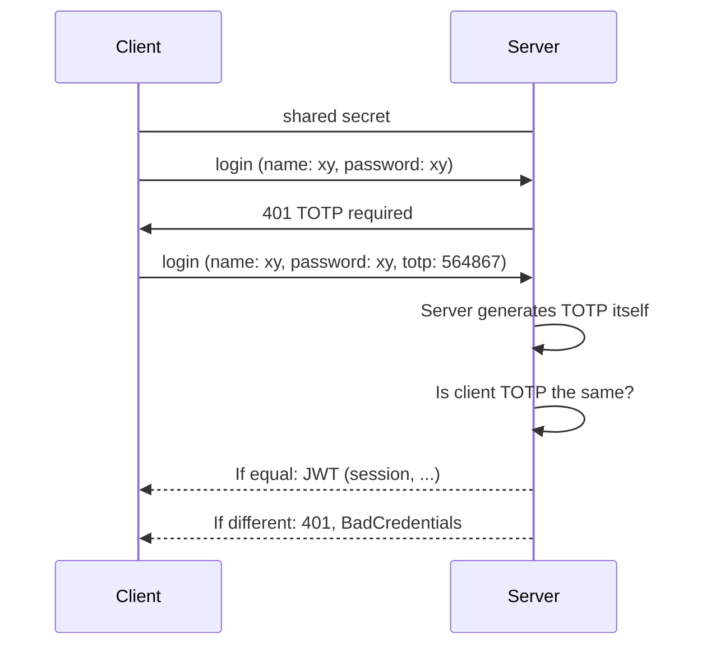

# totp-kt - Kotlin OTP Library
[](https://sonarcloud.io/summary/new_code?id=robinohs_totp-kt)

[](https://opensource.org/licenses/MIT) [](https://dl.circleci.com/status-badge/redirect/gh/robinohs/totp-kt/tree/main) [](https://codecov.io/gh/robinohs/totp-kt) [](https://sonarcloud.io/summary/new_code?id=robinohs_totp-kt) [](https://sonarcloud.io/summary/new_code?id=robinohs_totp-kt) [](https://sonarcloud.io/summary/new_code?id=robinohs_totp-kt) [](https://sonarcloud.io/summary/new_code?id=robinohs_totp-kt)

Native Kotlin library for time-based TOTP and HMAC-based HOTP one-time passwords.
Enables the developer to:
- validate and generate TOTP [(RFC 6238)](https://datatracker.ietf.org/doc/html/rfc6238) and HOTP [(RFC 4226)](https://datatracker.ietf.org/doc/html/rfc4226) one-time passwords,
- generate randomly secure secrets to use with authenticators,
- generate randomly secure recovery codes.

# Navigation
 - [Installation](#installation)
	- [Jitpack](#jitpack)
		- [Kotlin DSL](#kotlin-dsl)
		- [Maven](#maven)
		- [Gradle](#gradle)
 - [Usage](#usage)
    - [TOTP (Time-based One-Time Password)](#totp-time-based-one-time-password)
    - [HOTP (HMAC-based One-Time Password)](#hotp-hmac-based-one-time-password)
    - [Recovery code generator](#hotp-hmac-based-one-time-password)
    - [Google Authenticator](#google-authenticator)
  - [License](#license)


# Installation

> Only Jitpack is supported in the alpha phase.

## Jitpack
If you are using Jitpack as a repository, you can follow one of the following sections to install using with your favorite package manager such as gradle or maven.

#### Kotlin DSL
Add Jitpack to repositories:
```kotlin
//build.gradle.kts
repositories {  
  mavenCentral()  
  maven { url = uri("https://jitpack.io") }  
}
```
Add the dependency:
```kotlin
//build.gradle.kts
dependencies {
  implementation("com.github.robinohs:totp-kt:v1.0.2-alpha")
}
```
#### Maven
Add Jitpack to repositories:
```xml
//pom.xml
<repositories>
  <repository>
    <id>jitpack.io</id>
    <url>https://jitpack.io</url>
  </repository>
</repositories>
```
Add the dependency:
```xml
//pom.xml
<dependency>
  <groupId>com.github.robinohs</groupId>
    <artifactId>totp-kt</artifactId>
    <version>v1.0.2-alpha</version>
</dependency>
```
#### Gradle
Add Jitpack to repositories:
```kotlin
//build.gradle
allprojects {
  repositories {
    ...
    maven { url 'https://jitpack.io' }
  }
}
```
Add the dependency:
```kotlin
//build.gradle
dependencies {
  implementation 'com.github.robinohs:totp-kt:v1.0.2-alpha'
}
```
# Usage
## TOTP (Time-based One-Time Password)
Time-based One-Time Password generates one-time passwords by a shared secret combined with a current time window as the source for uniqueness. The TOTP algorithm is an extension of [HOTP](#hotp-hmac-based-one-time-password). The algorithm is used by commonly known authenticator apps, e.g. Google Authenticator, Mircrosoft Authenticator and others.
### Basic TOTP flow

### Create a TOTP generator
You can create an instance of the TOTPGenerator in the following way:
```kotlin
val totpGenerator = TotpGenerator()
```
It is possible to customize the properties of the generator, either by setters or applying them in the constructor.
#### Clock
The clock is the time source for the generator if no time is passed as an argument to the generate or validate function.
```kotlin
val totpGenerator = TotpGenerator(clock = Clock.systemUTC())
// or
totpGenerator.clock = Clock.systemUTC()
```
> For testing purposes, one could assign a **Clock.fixed** that always returns the same timestamp and thus the same TOTP code.

## HOTP (HMAC-based One-Time Password)
TODO
## Recovery code generator
TODO
## Spring Boot
TODO
## Google Authenticator
TODO
# License
[MIT](https://github.com/robinohs/totp-kt/blob/master/LICENSE)
