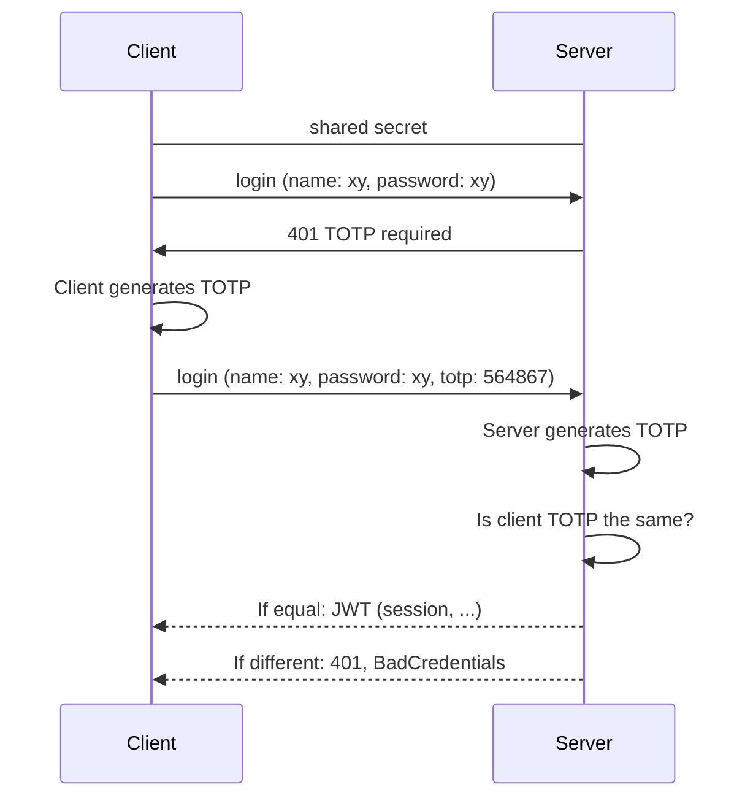
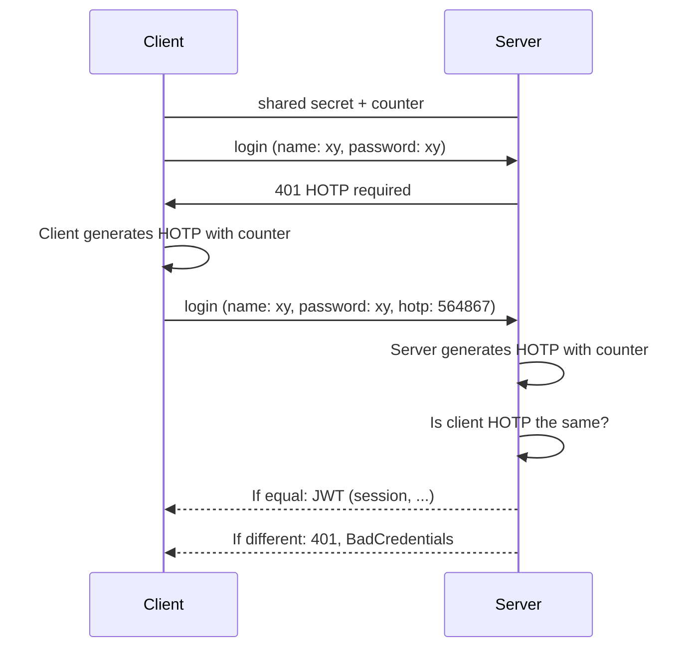

# totp-kt - Kotlin OTP Library
[](https://sonarcloud.io/summary/new_code?id=robinohs_totp-kt)

[](https://opensource.org/licenses/MIT) [](https://dl.circleci.com/status-badge/redirect/gh/robinohs/totp-kt/tree/main) [](https://codecov.io/gh/robinohs/totp-kt) [](https://sonarcloud.io/summary/new_code?id=robinohs_totp-kt) [](https://sonarcloud.io/summary/new_code?id=robinohs_totp-kt) [](https://sonarcloud.io/summary/new_code?id=robinohs_totp-kt) [](https://sonarcloud.io/summary/new_code?id=robinohs_totp-kt)

Native Kotlin library for time-based TOTP and HMAC-based HOTP one-time passwords.
Enables the developer to:
- validate and generate TOTP [(RFC 6238)](https://datatracker.ietf.org/doc/html/rfc6238) and HOTP [(RFC 4226)](https://datatracker.ietf.org/doc/html/rfc4226) one-time passwords,
- generate randomly secure secrets to use with authenticators,
- generate randomly secure recovery codes.

# Navigation
 - [Installation](#installation)
	- [Jitpack](#jitpack)
		- [Kotlin DSL](#kotlin-dsl)
		- [Maven](#maven)
		- [Gradle](#gradle)
 - [Usage](#usage)
    - [TOTP (Time-based One-Time Password)](#totp-time-based-one-time-password)
    - [HOTP (HMAC-based One-Time Password)](#hotp-hmac-based-one-time-password)
    - [Secret generator](#secret-generator)
    - [Recovery-Code generator](#recovery-code-generator)
    - [Random Generator](#random-generator)
  - [Spring Boot](#spring-boot)
  - [License](#license)


# Installation

> Only Jitpack is supported in the alpha phase.

## Jitpack
If you are using Jitpack as a repository, you can follow one of the following sections to install using with your favorite package manager such as gradle or maven.

#### Kotlin DSL
Add Jitpack to repositories:
```kotlin
//build.gradle.kts
repositories {  
  mavenCentral()  
  maven { url = uri("https://jitpack.io") }  
}
```
Add the dependency:
```kotlin
//build.gradle.kts
dependencies {
  implementation("com.github.robinohs:totp-kt:v1.0.2-alpha")
}
```
#### Maven
Add Jitpack to repositories:
```xml
//pom.xml
<repositories>
  <repository>
    <id>jitpack.io</id>
    <url>https://jitpack.io</url>
  </repository>
</repositories>
```
Add the dependency:
```xml
//pom.xml
<dependency>
  <groupId>com.github.robinohs</groupId>
    <artifactId>totp-kt</artifactId>
    <version>v1.0.2-alpha</version>
</dependency>
```
#### Gradle
Add Jitpack to repositories:
```kotlin
//build.gradle
allprojects {
  repositories {
    ...
    maven { url 'https://jitpack.io' }
  }
}
```
Add the dependency:
```kotlin
//build.gradle
dependencies {
  implementation 'com.github.robinohs:totp-kt:v1.0.2-alpha'
}
```
# Usage
## TOTP (Time-based One-Time Password)
The time-based one-time password method, generates one-time passwords by using a shared secret in combination with a time window as the source of uniqueness. The TOTP algorithm is an extension of [HOTP](#hotp-hmac-based-one-time-password). The algorithm is used by commonly known authenticator apps, e.g. Google Authenticator, Mircrosoft Authenticator and others.

### TOTP flow

### Create a TOTP generator
You can create an instance of the TotpGenerator in the following way:
```kotlin
val totpGenerator = TotpGenerator()
```
### Use the TOTP generator
#### Method: Generate Code
After you created the totpGenerator instance you can generate a one-time password by calling the generatore code method with the secret as an argument. Optionally, if you want to specify a specific time and not have the generator to take the current time itself, you can pass a time as an argument.
```kotlin
val secret = some base32_encoded_secret_as_bytearray
val code = totpGenerator.generateCode(secret)
```
If one would like to specify a time:
```kotlin
// with millis
totpGenerator.generateCode(secret, 1656459878681)
// with Instant
totpGenerator.generateCode(secret, Instant(...))
// with Date
totpGenerator.generateCode(secret, Date(...))
```
#### Method: Validate Code
There is a helper function to compare a currently generated code with a given code. Optionally, you can also use generateCode yourself and compare the resulting string to the client's code.
```kotlin
val secret = some base32_encoded_secret_as_bytearray
val clientCode = given client_code
totpGenerator.isCodeValid(secret, clientCode)
```
If one would like to specify a time:
```kotlin
// with millis
totpGenerator.isCodeValid(secret, 1656459878681, clientCode)
// with Instant
totpGenerator.isCodeValid(secret, Instant(...), clientCode)
// with Date
totpGenerator.isCodeValid(secret, Date(...), clientCode)
```
#### Method: Validate Code With Tolerance
The tolerance is a duration that is subtracted from the timestamp the server creates when he generates a code in the isValidWithTolerance merthod. All codes generated within this period are matched against the client's token. If any of them matches, the code is accepted.
```kotlin
val secret = some base32_encoded_secret_as_bytearray
val clientCode = given client_code
totpGenerator.isCodeValidWithTolerance(secret, clientCode)
```
If one would like to specify a time:
```kotlin
// with millis
totpGenerator.isCodeValidWithTolerance(secret, 1656459878681, clientCode)
// with Instant
totpGenerator.isCodeValidWithTolerance(secret, Instant(...), clientCode)
// with Date
totpGenerator.isCodeValidWithTolerance(secret, Date(...), clientCode)
```
### Customize properties
It is possible to customize the properties of the generator, either by setters or applying them in the constructor.
#### Clock
The clock is the time source for the generator if no time is passed as an argument to the generate or validate function.
```kotlin
val totpGenerator = TotpGenerator(clock = Clock.systemUTC())
// or
totpGenerator.clock = Clock.systemUTC()
```
> For testing purposes, one could assign a **Clock.fixed** that always returns the same timestamp and thus the same TOTP code.
#### Timeperiod
The timeperiod is the duration of every time step in which the generated code is the same. This is needed as due to delays (e.g., network delay) the server will not generate the code with the same timestamp as the client. As a compromise between security and usability the default time step is set as 30 seconds.
> A time period of 30 seconds is used by the Google or Mircrosoft Authenticator app.
#### Tolerance
The tolerance is a duration that is subtracted from the timestamp the server creates when he generates a code in the isValidWithTolerance merthod. All codes generated within this period are matched against the client's token. If any of them matches, the code is accepted.
#### Code Length
The code length specifies how long a generated code will be. If the code length is changed, it is necessary that the user's authenticator app supports this as well.
> A length of 6 digits is used by the Google or Mircrosoft Authenticator app.
## HOTP (HMAC-based One-Time Password)
The HMAC-based one-time password method generates one-time passwords by using a shared secret in combination with a counter as the source of uniqueness. The major problem of this approach is the synchronization of the counter between the client and the server. Synchronization is out of scope for this library and therefore needs to be implemented by the consumer. A method for re-synchronization is described in the specification [RFC4226#7.4](https://datatracker.ietf.org/doc/html/rfc4226#section-7.4).


### HOTP flow

### Create a HOTP generator
You can create an instance of the HotpGenerator in the following way:
```kotlin
val hotpGenerator = HotpGenerator()
```
### Use the HOTP generator
#### Method: Generate Code
After you created the hotpGenerator instance you can generate a one-time password by calling the generatore code method with the secret and the counter as arguments.
```kotlin
val secret = some base32_encoded_secret_as_bytearray
val counter = some number
val code = hotpGenerator.generateCode(secret, counter)
```
#### Method: Validate Code
There is a helper function to compare a generated code with a given code. Optionally, you could also use generateCode yourself and compare the resulting string to the client's code.
```kotlin
val secret = some base32_encoded_secret_as_bytearray
val counter = some number
val clientCode = given client_code
totpGenerator.isCodeValid(secret, counter, clientCode)
```
### Customize properties
It is possible to customize the properties of the generator, either by setters or applying them in the constructor.
#### Code Length
The code length specifies how long a generated code will be. If the code length is changed, it is necessary that the user's authenticator app supports this as well.

## Secret generator
The secret generator can be used to generate base32 encoded secrets as strings and bytearrays.
### Create a Secret  generator
You can create an instance of the SecretGenerator in the following way:
```kotlin
val secretGenerator = SecretGenerator()
```
### Use the Secret generator
#### Method: Generate Secret
If you want to generate a secret that can be used as a shared secret between the client and the server, there is the generateSecret function. The default behavior of the function is to generate a 10 character secret and convert it to a Base32Secret instance. Optionally you can specify the length of the plain input to the base32 encoding secret.
```kotlin
val base32Secret: Base32Secret = secretGenerator.generateSecret()
```
#### Class: Base32Secret
The Base32Secret data class contains a secret in the form of a bytearray and a string.
```kotlin
val base32Secret: Base32Secret = secretGenerator.generateSecret()
val (secretAsString, secretAsByteArray) = base32Secret
```
### Customize properties
It is possible to customize the properties of the generator, either by setters or applying them in the constructor.
#### Random Generator
The RandomGenerator instance used internally to generate random strings.

## Recovery-Code generator
This generator can be used to create a randomly generated string in block form.
### Create a Recovery-Code generator
You can create an instance of the RecoveryCodeGenerator in the following way:
```kotlin
val recoveryCodeGenerator = RecoveryCodeGenerator()
```
### Use the Recovery-Code generator
#### Method: Generate Recovery-Code
This method generates a single recovery-code.
```kotlin
val recoveryCode = recoveryCodeGenerator.generateRecoveryCode()
println(recoveryCode)
"AAAA-BBBB-CCCC-DDDD"
```
#### Method: Generate a list of Recovery-Codes
This method generates a list of recovery-codes.
```kotlin
val recoveryCodes = recoveryCodeGenerator.generateRecoveryCodes(3)
println(recoveryCodes)
["AAAA-BBBB-CCCC-DDDD", "BBBB-AAAA-CCCC-DDDD", "BBBB-AAAA-DDDD-CCCC"]
```
### Customize properties
It is possible to customize the properties of the generator, either by setters or applying them in the constructor.
#### Number of blocks
Specifies the number of blocks that make up each recovery code.
#### Blocklength
Specifies the length of each block in each recovery code.
#### Random Generator
The RandomGenerator instance used internally to generate random strings.

## Random Generator
The random generator is internally used by the [SecretGenerator](#secret-generator) and [RecoveryCodeGenerator](#secret-generator) to create randomly secure strings.
### Customize properties
It is possible to customize the properties of the generator, either by setters or applying them in the constructor.
#### Random (Dangerous)
The generator accepts any class implementing the java random interface.
> The default is the SecureRandom implementation and should not be changed unless you know what you are doing!
#### Charpool (Dangerous)
The char pool specifies the list of characters that can be used to generate the string.
> If the char pool gets too small, the security is weakend. For example a 10-character long password with the default charset of the library has the following properties:$$
Combinations: 62^{10} = 8.3929937e^{17}\\
Entropy: log_2(62^{10}) = 59.542
$$
Passwords with a entropy >50 are considered to be secure.
## Spring Boot
Instead of creating a new instance of any generator each time a token is checked, it is also possible to create a bean within Spring.
```kotlin
@Bean  
fun totpGenerator(): TotpGenerator {  
    val generator = TotpGenerator()  
    generator.codeLength = 9
    generator.timePeriod = Duration.ofSeconds(20)
    return generator
}  
  
@Bean  
fun recoveryCodeGenerator(): RecoveryCodeGenerator {  
    val generator = RecoveryCodeGenerator()
    generator.blockLength = 5
    return generator
}
```
You can then access the instance in the constructor of every class marked with @Component (@Service, ...).
```kotlin
@Component  
class CustomComponent(  
  private val totpGenerator: TotpGenerator,
  private val recoveryCodeGenerator: RecoveryCodeGenerator
) {
	...
}
```
# License
[MIT](https://github.com/robinohs/totp-kt/blob/master/LICENSE)
